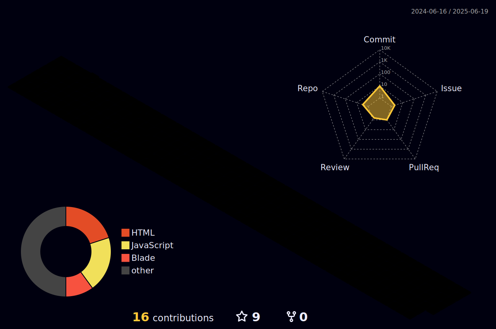

<h2 height="200px" align="center">Vamsi </h2>
<h2 align="center">I'm a developer and analyst who loves the aesthetics of data!</h3>

  
  
  
  
  
  
  
  

  
  
  
  
  
   

 

# <a href="">Vamsi's instructions</a>

- 🧱 Work Experience：Infiniti(2019) ✈️ SS4U(2021) ✈SurtLabs(2022) 🚀 Arccus(2023)
- 🚀 Frontend Adventures: http://vamsikrishna.netlify.app
- ✨ You can contact me at [vamsicse0@gmail.com](mailto:vamsicse@gmail.com)
- 💬 Welcome to communicate!

# Open Source
-  
    
  Plex Meta Manager is an open source Python 3 project that has been designed to ease the creation and maintenance of metadata, collections, and playlists within a Plex Media Server.This is a small wrapper around the web interface that the server provides so most of the developement happens there.

## Technical articles

- [Python-in-Excel](https://dev.to/vamsikrishna71/supercharge-your-spreadsheet-skills-with-python-in-microsoft-excel-2b5b): 🚀 Supercharge Your Spreadsheet Skills with Python in Microsoft Excel
- [Laravel-Eloquent](https://dev.to/vamsikrishna71/laravel-eloquent-multiple-dependent-model-13ba) ：🚀 Laravel eloquent multiple dependent model
 

### Socials

 <a href="https://www.dev.to/vamsikrishna71" target="_blank" rel="noreferrer"> <picture> <source media="(prefers-color-scheme: dark)" srcset="https://raw.githubusercontent.com/danielcranney/readme-generator/main/public/icons/socials/devdotto-dark.svg" /> <source media="(prefers-color-scheme: light)" srcset="https://raw.githubusercontent.com/danielcranney/readme-generator/main/public/icons/socials/devdotto.svg" />  </picture> </a> <a href="https://www.github.com/vamsikrishna71" target="_blank" rel="noreferrer"> <picture> <source media="(prefers-color-scheme: dark)" srcset="https://raw.githubusercontent.com/danielcranney/readme-generator/main/public/icons/socials/github-dark.svg" /> <source media="(prefers-color-scheme: light)" srcset="https://raw.githubusercontent.com/danielcranney/readme-generator/main/public/icons/socials/github.svg" />  </picture> </a> <a href="https://www.linkedin.com/in/vamsi-krishna-908005153" target="_blank" rel="noreferrer"> <picture> <source media="(prefers-color-scheme: dark)" srcset="https://raw.githubusercontent.com/danielcranney/readme-generator/main/public/icons/socials/linkedin-dark.svg" /> <source media="(prefers-color-scheme: light)" srcset="https://raw.githubusercontent.com/danielcranney/readme-generator/main/public/icons/socials/linkedin.svg" />  </picture> </a> <a href="http://www.medium.com/@vamsicse0" target="_blank" rel="noreferrer"> <picture> <source media="(prefers-color-scheme: dark)" srcset="https://raw.githubusercontent.com/danielcranney/readme-generator/main/public/icons/socials/medium-dark.svg" /> <source media="(prefers-color-scheme: light)" srcset="https://raw.githubusercontent.com/danielcranney/readme-generator/main/public/icons/socials/medium.svg" />  </picture> </a>

## SDK

- [ML-Course-Recommender-Model](https://vamsi-ml-course-model.streamlit.app/): A small tool for Recommend course based on selection. It also has the ability to test and train the model.
- [Dynamic-Sliders-Model](https://vamsi-sliders-df.streamlit.app/): Dynamic sliders used to change the shape of Dataframe and collective strengths of graph.

  

# Github Status

